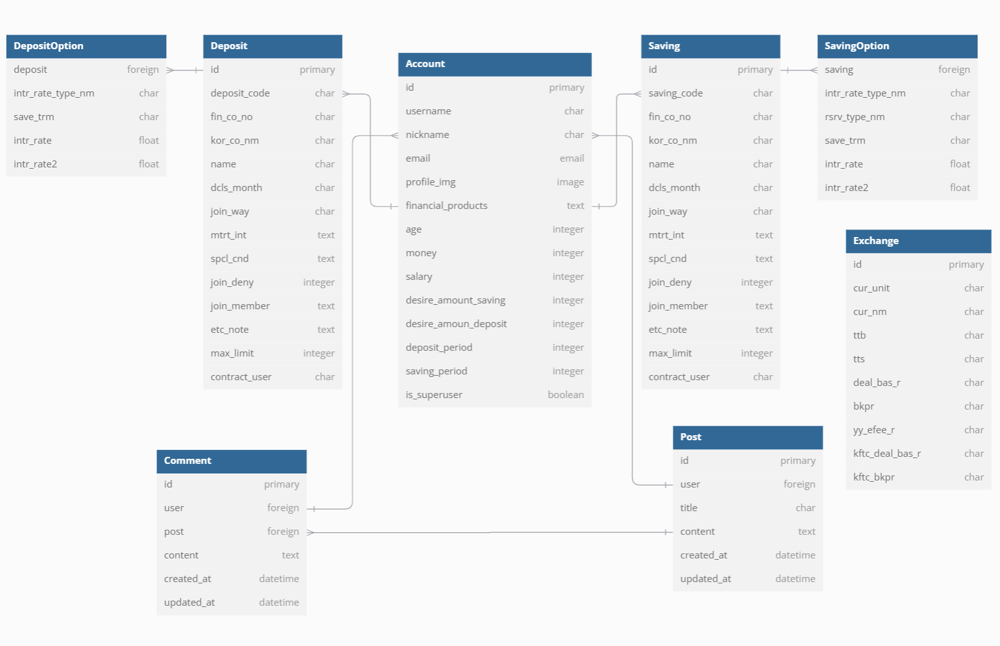

# DONGUL Project
* 이용자들에게 개인정보맞춤형 금융상품들을 알려주는 서비스를 제공합니다.
* 추가기능 : 환율계산기, 근처 은행 검색, 금융상품비교

<hr>
(https://skillicons.dev)
(https://skillicons.dev)

## 프로젝트 목표
1. <strong>금융 상품 비교 애플리케이션 서비스 완성</strong>
  - 서비스를 소개할 수 있도록 Carousel 및 적절한 이미지를 활용하여 화면 구성

2. <strong>회원 커스터마이징</strong>
  - 회원 관리 기능(CRUD)
  - 회원 관리 라이브러리의 자유로운 사용
  - 커스텀 User 구현
  - Serializer 구성
  - 유저이름, 이메일, 가입상품목록 저장할 수 있는 필드 구성

3. <strong>예적금 금리 비교</strong>
  - 금융상품 데이터를 API를 활용하여 저장
  - 가져온 금융상품 데이터를 필터링할 수 있도록 추가기능 구성
  - 선호 은행 선택 시, 해당 은행의 금융상품 목록 조회
  - 특정 상품 클릭 시 상세정보를 볼 수 있도록 구성
  - 상세정보에서 로그인된 회원은 금융상품 가입 가능하도록 설정

4. <strong>환율 계산기</strong>
  - API활용하여 환율 데이터 저장
  - 원하는 국가의 통화를 선택하고 그에 맞는 원화계산기능 구현

5. <strong>근처 은행 검색</strong>
  - API를 활용하여 지도 표시
  - 위치와 은행을 선택할 수 있도록 구성
  - 선택 시, 해당 위치 근처의 은행 정보 출력

6. <strong>커뮤니티(게시판)</strong>
  - 회원간 소통이 가능하도록 커뮤니티 기능 구현
  - 게시글CRUD
  - 로그인된 회원의 권한에 따른 동작 구분하여 구성
    - ex) 본인이 작성한 게시글 및 댓글만 삭제, 수정 등

7. <strong>프로필 페이지</strong>
  - 회원의 기본 정보 출력
  - 정보 수정이 가능하도록 구성
  - 가입한 금융 상품 리스트 출력하는 화면 구현
  - 차트 라이브러리를 활용한 상품 금리 정보를 그래프로 출력

8. <strong>금융 상품 추천 알고리즘</strong>
  - 추천 방식 : 회원의 기본정보에 근거한 추천 상품 구성
  - 1) 나이에 따라 가중치를 두어서, 자산이 많으면 최대가입금액이 높은 상품을, 연봉이 높으면 최대금리상품을 추천하기
  - 2) 사용자 정보에 입력한 희망 예치 금액과 기간에 맞는 상품을 추천하기
<hr>

## Member <br>(팀원 정보 및 업무 분담 내역)

- <em> 김천우 : Backend(Django), Frontend(Vue, [환율 그래프, 금융상품 조회])
- <em> 박성재 : Frontend(Vue, [Design, UserCRUD, PostCRUD, MAP API, 등])

<hr>

## 설계 내용(아키텍처 등) 및 실제 구현 정도
```
DONGUL/
├── back/                      - Django 백엔드
│   ├── accounts/              - 회원 관리 (로그인, 회원가입, 사용자 프로필)
│   ├── articles/              - 커뮤니티 게시판 (게시물 및 댓글 관리)
│   ├── exchange/              - 환율 계산 및 데이터 처리
│   ├── final_pjt_back/        - 프로젝트 설정 및 공통 설정
│   ├── financials/            - 금융 상품 데이터 관리 (예금, 적금, 대출)
│   ├── recommend/             - 추천 시스템 (개인화 금융 상품 추천)
│   ├── media/                 - 업로드된 미디어 파일 저장소
│   ├── db.sqlite3             - SQLite 데이터베이스 파일
│   ├── manage.py              - Django 관리 명령 실행
│   ├── requirements.txt       - Python 패키지 의존성 파일
│   ├── make_data.py           - 데이터 초기화 및 로드 스크립트
│   

│
├── front/                     - React/Vue 프론트엔드
│   ├── public/                - 정적 파일 (HTML, 이미지)
│   ├── src/                   - Vue 소스 코드
│   │   ├── assets/            - 정적 자원 (CSS, 이미지, 글꼴)
│   │   ├── components/        - Vue 컴포넌트 (UI 및 기능 단위)
│   │   ├── data/              - 데이터 관리 (API 통신, 데이터 모델)
│   │   ├── router/            - Vue 라우터 설정 (페이지 이동 관리)
│   │   ├── stores/            - 상태 관리 (Pinia/Vuex 사용)
│   │   ├── views/             - 페이지 컴포넌트 (라우트와 연결)
│   ├── App.vue                - Vue 루트 컴포넌트
│   ├── main.js                - Vue 진입점 및 초기 설정
│   ├── package.json           - Node.js 의존성 및 스크립트 관리
│
└── README.md                  - 프로젝트 개요 및 설명

```
- <strong>작동 방식</strong>
  1. 사용자 요청을 Django 백엔드로 수신
  2. 요청에 따라 데이터베이스 작업 또는 외부 API 호출 수행
  3. JSON 형식의 데이터를 프론트엔드로 반환
  4. React 컴포넌트를 기반으로 동적 UI 렌더링
  5. Django 백엔드에서 데이터를 받아 화면에 표시
  6. 사용자의 상호작용(클릭, 입력 등)에 따라 데이터 요청 및 전송

<hr>

- <strong>데이터 흐름</strong>
  1. 클라이언트 요청
       - 사용자가 React 앱에서 특정 작업(예: 금융 상품 추천 요청)을 수행
       - Axios 또는 Fetch API를 통해 Django 백엔드로 HTTP 요청 전송 
  2. 백엔드 처리
        - Django에서 요청을 수신하고, URL 경로에 따라 적절한 View함수 실행
        - 데이터베이스에서 필요한 데이터를 검색하거나 외부 API와 상호작용
        - 결과를 JSON으로 응답
  3. 프론트엔드 렌더링
        - 백엔드에서 받은 데이터를 React 상태(State)에 저장
        - 컴포넌트 렌더링을 통해 사용자 화면에 데이터 표시
- <strong>주요 기능</strong>
   1. 사용자 인증 및 관리 (accounts)
        - JWT 토큰을 사용한 인증
        - 사용자 정보 조회 및 수정
   2. 커뮤니티 게시판(articles)
        - 게시물 CRUD
        - 댓글 CRUD
   3. 환율 조회 및 관리(exchange)
        - 외부 환율 API 연동(실시간 환율 데이터 가져오기)
        - 환율 변동 그래프 제공
   4. 금융 상품 추천 시스템 (financials, recommend)
        - 사용자 입력 데이터(나이, 연봉, 자산 등)을 기반으로 추천
        - 금융 상품(예금, 적금) 데이터 정렬 및 필터링
        - 사용자 경험 데이터를 기반으로 개인화된 추천 제공
- <strong>기술 스택</strong>
  - Backend (Django)
    - Django REST Framework (DRF) 사용.
    - SQLite 데이터베이스
  - Frontend (React)
    - React와 Vite를 사용한 프론트엔드 개발
    - Axios를 사용한 API통신

- <strong>향후 개선 사항</strong>
    1. 데이터베이스 확장
        - SQLite -> PostgreSQL 또는 MySQL로 전환
    2. 백엔드 API 최적화
        - 캐싱 및 쿼리 최적화
    3. 프론트엔드 성능
        - 코드 스플리팅 및 Lazy Loading 도입
   
## 데이터베이스 모델링(ERD)


## 금융 상품 추천 알고리즘에 대한 기술적 설명
1) 
`나이`가 많을수록 집구매와 같은 목돈이 들어가는 일이 적다는 판단하에 자산이 많으면 금리가 조금 낮더라도 최대가입금액이 높은 상품을 추천하는 것을 우선순위로 판단했습니다. <br> 
반대로, `나이`가 적으면 `자산`보다는 `연봉`에 더 비중을 높게 두었습니다. 목돈이 들어가는 일이 많다는 판단하에 저축기간이 짧더라도 금리가 높은 상품을 우선순위로 판단했습니다. <br>
`나이`와는 상관없이 각자 처한 환경이 다를 수도 있기에, 자산이 많은지, 연봉이 자산보다 많은지를 판단하고 그에 따른 추천리스트를 맞춰서 제공했습니다.<br>

`연봉`이 높으면 최대금리상품을 추천하는 것을 우선순위로 판단했습니다.<br>
위 해당사항에 맞게끔 상품이 추천하도록 알고리즘을 작성했습니다.

1) 사용자가 Mypage에서 자신의 정보를 입력하고 입력한 희망 예치 금액과 기간에 맞는 상품을 추천하도록 알고리즘을 작성했습니다.

## 생성형 AI를 활용한 부분
고민을 해도 해결이 되지않는 에러가 발생할 때 생성형 AI를 활용해 에러를 해결했습니다. 또한 광범위한 CSS 범위에서 원하는 디자인을 찾고 싶을 때도 활용했습니다. 다음엔 생성형 AI를 활용해 챗봇 기능 구현에 도전해보고 싶습니다.

## 기타(느낀점, 후기 등)
- <em> 김천우 : 추천 알고리즘을 짜면서 DB에서의 필터기능을 사용하는 경우, 데이터베이스에서 바로 추출하고 필터링할지, 아니면 데이터베이스에서 필터링을 해서 가져오는 지에 따라 서비스를 이용하는 소비자입장에서 다른 경험을 할 수 있겠다는 생각을 했습니다. 결국 데이터를 읽어오고 내보내는 방식을 어떠한 판단 기준으로 정할지에 대한 고민을 제일 오래했던 것 같습니다. 여러 번 디버깅해본서 사소한 오타로 데이터를 못읽어오기도 하고, 웹페이지에서 직접 출력물을 보면서 디버깅을 진행할 때는 전에는 되었던 기능이 안되는 원인 판단에 있어 어려움을 많이 느꼈고, 프로젝트의 목표를 이루기 위해 꾸준히 하다보니 이전에 구분되었던 지식들이 하나의 흐름으로 이어져 뿌듯했습니다.

- <em> 박성재 : 배운 것을 실제 개발에 접목 시키는 것이 생각보다 많이 어렵다는 것을 느꼈습니다. 정말 사소한 오타로 인한 에러부터, 원인을 알 수 없는 에러까지 수 많은 역경을 만났지만, 그것들을 넘어서며 한 걸음 더 나아갈 수 있었던 좋은 시간인 것 같습니다. 방학과 계절 학기를 이용해 좀 더 이 프로젝트를 발전시켜보고 싶습니다. 또한 같이 고생한 천우형이 없었다면, 완수하지 못했을 것 같습니다. 함께 문제를 해결하고 회의를 거치며 결과물을 만드는 과정을 통해 협업의 중요성 또한 깨달았습니다.
